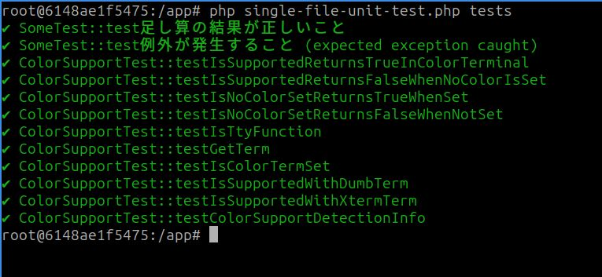

# single-file-unit-test

A **zero-dependency, single-file unit testing framework** for PHP 5.6 and above.  
Just `require 'single-file-unit-test.php'` and you're ready to start testing, with a design that facilitates migration to PHPUnit.

---

## Why was this created?

This framework was born from the experience of supporting **legacy PHP projects in crisis**.

- No `composer` setup
- No framework, or custom legacy implementations
- Zero test code, making it difficult to set up a testing environment

This tool was created to meet the real-world need of "**I just want to write my first test**" in such situations.

---

## Features

- Works with just `require 'single-file-unit-test.php'`
- Supports `assertSame` and `expectExceptionMessage`
- PHPUnit-compatible `TestCase` inheritance (easy migration to PHPUnit later)
- CLI execution with `php single-file-unit-test.php tests/`
- `--help` and `--version` options for help and version display
- Exit codes for success/failure determination (CI compatible)
- PHP 5.6 to 8.4 support (GitHub Actions ready)

---

## Usage

### A. Using as a Library

```php
<?php

require 'single-file-unit-test.php';

use Smeghead\SingleFileUnitTest\TestCase;

class MyTest extends TestCase {
    public function testSomething() {
        $this->assertSame(2, 1 + 1);
    }
}

// Run a single test class
(new MyTest())->runTests();

// Display results (optional)
TestCase::showResults();
```

### B. Using as a CLI Test Runner

```bash
# Run tests
php single-file-unit-test.php tests/

# Show help
php single-file-unit-test.php --help

# Show version
php single-file-unit-test.php --version
```

**Options:**
- `-h, --help`: Display help message
- `-v, --version`: Display version information

**Behavior:**
- Recursively searches the `tests/` directory and loads `*Test.php` files
- Exits with `exit(1)` if any test fails (CI compatible)

---

## Sample Test

```php
<?php

use Smeghead\SingleFileUnitTest\TestCase;

class Some {
    public function add($a, $b) { return $a + $b; }
    public function error() { throw new Exception("Error occurred"); }
}

class SomeTest extends TestCase {
    public function testAdd() {
        $this->assertSame(3, (new Some())->add(1, 2));
    }

    public function testThrows() {
        $this->expectExceptionMessage("Error occurred");
        (new Some())->error();
    }
}
```



---

## License

MIT License  
Copyright (c) 2025 smeghead
