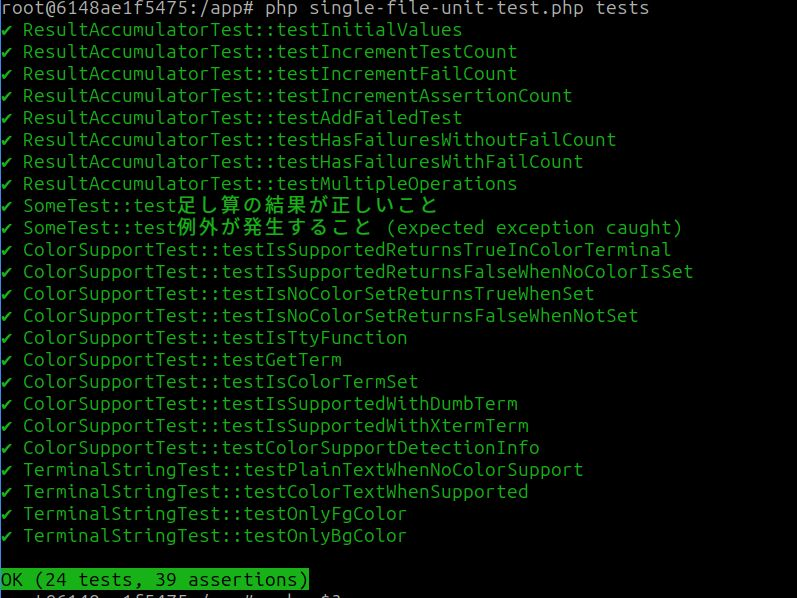

# single-file-unit-test

[](https://packagist.org/packages/smeghead/single-file-unit-test) [](https://packagist.org/packages/smeghead/single-file-unit-test) [](LICENSE) [](https://packagist.org/packages/smeghead/single-file-unit-test)

A **zero-dependency, single-file unit testing framework** for PHP 5.6 and above.  
Just `require_once 'single-file-unit-test.php'` and you're ready to start testing, with a design that facilitates migration to PHPUnit.

---

## Why was this created?

This framework was born from the experience of supporting **legacy PHP projects in crisis**.

- No `composer` setup
- No framework, or custom legacy implementations
- Zero test code, making it difficult to set up a testing environment

This tool was created to meet the real-world need of "**I just want to write my first test**" in such situations.

---

## Features

- Works with just `require_once 'single-file-unit-test.php'`
- Supports `assertSame` and `expectExceptionMessage`
- Supports `setUp` and `tearDown` methods for test preparation and cleanup
- PHPUnit-compatible `TestCase` inheritance (easy migration to PHPUnit later)
- CLI execution with `php single-file-unit-test.php tests/`
- `--help` and `--version` options for help and version display
- Exit codes for success/failure determination (CI compatible)
- PHP 5.6 to 8.4 support (GitHub Actions ready)

---

## Install

Installation is **incredibly simple** - just download the single file to your project:

```bash
curl -o single-file-unit-test.php https://raw.githubusercontent.com/smeghead/single-file-unit-test/main/single-file-unit-test.php
```

That's it! No `composer install`, no complex setup, no dependencies to manage.  
Just one command and you're ready to start testing.

---

## Usage

### A. Using as a Library

```php
<?php

require_once 'single-file-unit-test.php';

use Smeghead\SingleFileUnitTest\TestCase;

class MyTest extends TestCase {
    private $calculator;

    protected function setUp(): void {
        // Called before each test method
        $this->calculator = new Calculator();
    }

    protected function tearDown(): void {
        // Called after each test method
        $this->calculator = null;
    }

    public function testAddition() {
        $this->assertSame(4, $this->calculator->add(2, 2));
    }

    public function testSubtraction() {
        $this->assertSame(0, $this->calculator->subtract(2, 2));
    }
}

// Run a single test class
(new MyTest())->runTests();

// Display results (optional)
TestCase::showResults();
```

### B. Using as a CLI Test Runner

```bash
# Run tests
php single-file-unit-test.php tests/

# Show help
php single-file-unit-test.php --help

# Show version
php single-file-unit-test.php --version
```

**Options:**
- `-h, --help`: Display help message
- `-v, --version`: Display version information
- `--generate-test-class=ClassName`: Generate a test class template

**Behavior:**
- Recursively searches the `tests/` directory and loads `*Test.php` files
- Exits with `exit(1)` if any test fails (CI compatible)

### C. Generate Test Class Template

```bash
# Generate a test class template
php single-file-unit-test.php --generate-test-class=Fuga

# Generate ExampleTest when no class name is specified
php single-file-unit-test.php --generate-test-class

# Save to a file
php single-file-unit-test.php --generate-test-class=Fuga > tests/FugaTest.php
```

**Generated template:**
```php
<?php

use Smeghead\SingleFileUnitTest\TestCase;

class FugaTest extends TestCase {
    public function test_1plus2_is_3() {
        $this->assertSame(3, (new Some())->add(1, 2));
    }

    public function test_it_must_throw_exception() {
        $this->expectExceptionMessage("Error occurred");
        (new Some())->error();
    }
}
```

This feature helps beginners get started quickly by providing a working test template that they can modify for their specific needs.

---

## setUp and tearDown Methods

The framework supports `setUp()` and `tearDown()` methods for test preparation and cleanup, just like PHPUnit:

- **`setUp()`**: Called before each test method runs - use for initializing test data, creating objects, setting up database connections, etc.
- **`tearDown()`**: Called after each test method runs - use for cleanup, closing connections, resetting state, etc.

```php
<?php

use Smeghead\SingleFileUnitTest\TestCase;

class DatabaseTest extends TestCase {
    private $db;

    protected function setUp(): void {
        // Initialize fresh database connection for each test
        $this->db = new PDO('sqlite::memory:');
        $this->db->exec('CREATE TABLE users (id INTEGER, name TEXT)');
    }

    protected function tearDown(): void {
        // Clean up after each test
        $this->db = null;
    }

    public function testInsertUser() {
        $stmt = $this->db->prepare('INSERT INTO users (id, name) VALUES (?, ?)');
        $result = $stmt->execute([1, 'John']);
        $this->assertSame(true, $result);
    }

    public function testUserCount() {
        $this->db->exec("INSERT INTO users (id, name) VALUES (1, 'Alice')");
        $count = $this->db->query('SELECT COUNT(*) FROM users')->fetchColumn();
        $this->assertSame('1', $count);
    }
}
```

Each test method gets a fresh, isolated environment thanks to `setUp()` and `tearDown()`, ensuring tests don't interfere with each other.

---

## Example Test

```php
<?php

use Smeghead\SingleFileUnitTest\TestCase;

class Some {
    public function add($a, $b) { return $a + $b; }
    public function error() { throw new Exception("Error occurred"); }
}

class SomeTest extends TestCase {
    public function testAdd() {
        $this->assertSame(3, (new Some())->add(1, 2));
    }

    public function testThrows() {
        $this->expectExceptionMessage("Error occurred");
        (new Some())->error();
    }
}
```



---

## License

MIT License  
Copyright (c) 2025 smeghead
